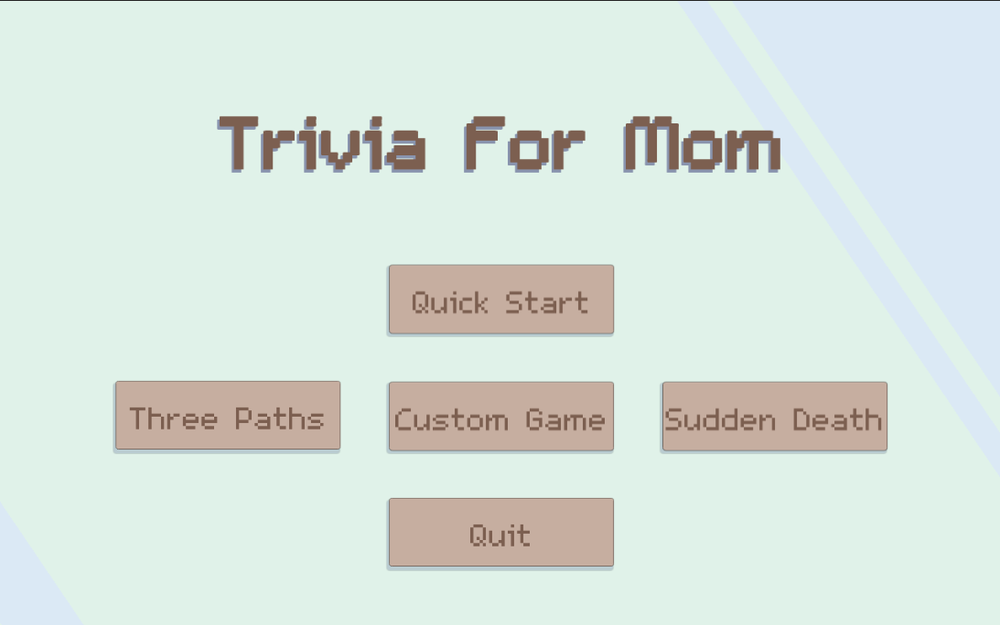
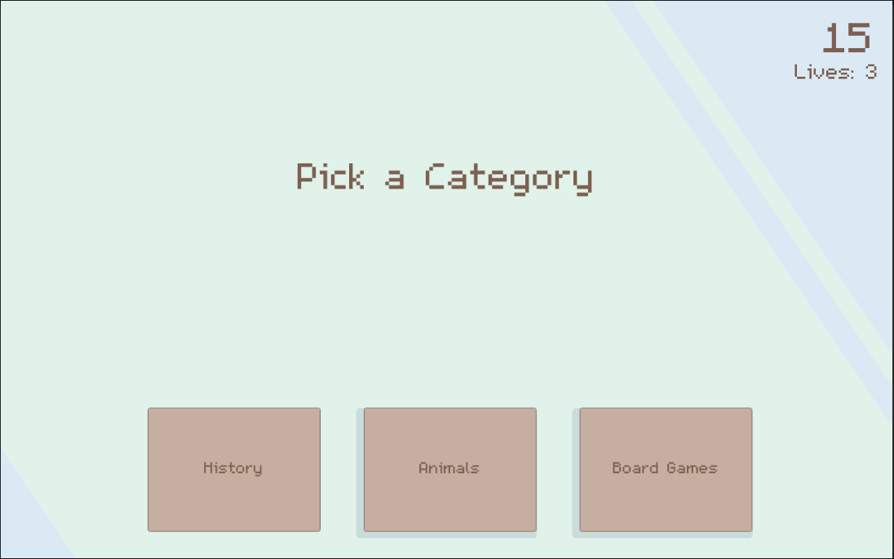
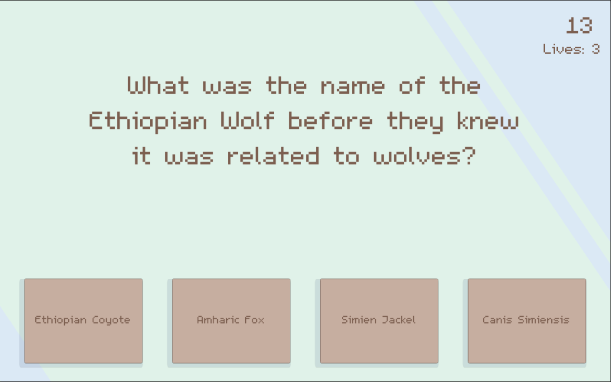
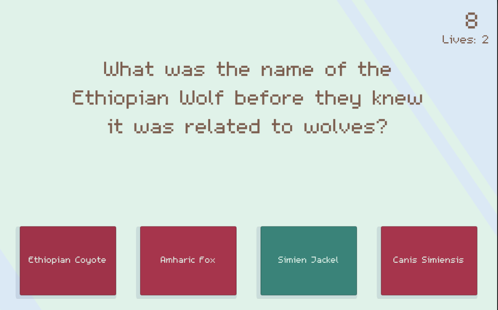
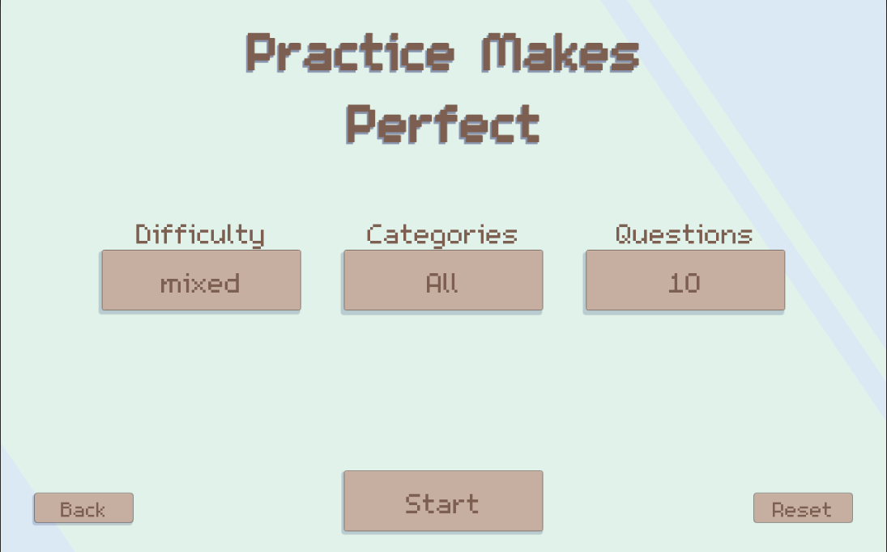

# Steam-Deck-Trivia-Game
My mom was visiting and we were playing the trivia game on my Discord bot and she liked the questions so I made a proper trivia game for her Steam Deck she recently got.

Questions are from the wonderful [Open Trivia Database API](https://opentdb.com/api_config.php)

You need an internet connection to play. If I update this I'll add a question caching system for offline mode. Adding deep user stats tied to a JSON save system and multiplayer could be neat but we'll see how much she plays it.

Very simple code it's 99% UI handling and animation staging.

Included is a Linux Build (resolution set at 1280 x 800 for Steam Deck).

And a simple Windows port (windowed at 1280x800).

My favourite game mode is 'Three Paths' where you pick one of three categories, answer 3 questions, then repeat until you run out of lives.

You can also make a custom game specifying the category, rounds, and difficulty.

